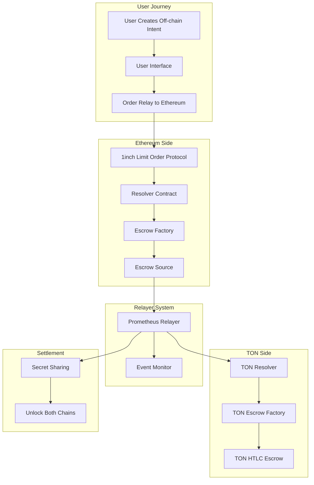

# FluxSwap - EVM to TON crosschain swap by 1inch Fusion+

## Overview

**FluxSwap** is a revolutionary cross-chain swap protocol that enables **gasless atomic swaps** between Ethereum and TON blockchains. Built on top of **1inch Fusion+ protocol**, FluxSwap allows users to seamlessly exchange tokens across chains without paying gas fees on the destination chain, while maintaining trustless execution through Hash Time Locked Contracts (HTLCs).

## 🌟 Key Features

- **🔄 Cross-Chain Atomic Swaps**: Trustless token exchanges between Ethereum and TON
- **⛽ Gasless Experience**: Users pay no gas fees on the destination chain
- **🔒 HTLC Security**: Hash Time Locked Contracts ensure atomic execution
- **🎯 Intent-Based Design**: Users express intent off-chain, resolvers execute on-chain
- **🤖 Automated Monitoring**: Prometheus-based relayer monitors all cross-chain events
- **⚡ 1inch Fusion+ Integration**: Leverages 1inch's advanced order matching system

## 🏗️ Architecture Overview



## 🔄 Complete Flow Architecture

### Phase 1: Intent Creation & Ethereum Execution

1. **User Creates Off-chain Intent**
   - User expresses desire to swap tokens cross-chain
   - Intent includes: source token, destination token, amounts, TON recipient address
   - Intent is cryptographically signed but not yet submitted

2. **Order Execution via 1inch Fusion+**
   - Resolver monitors pending intents
   - Resolver submits intent to 1inch Limit Order Protocol (LOP)
   - LOP validates order signature and parameters

3. **Escrow Deployment & Deposit**
   ```solidity
   // Resolver calls deploySrc function
   function deploySrc(
       IBaseEscrow.Immutables calldata immutables,
       IOrderMixin.Order calldata order,
       bytes32 r, bytes32 vs,
       uint256 amount,
       TakerTraits takerTraits,
       bytes calldata args
   ) external payable
   ```
   - **Escrow Factory** deploys a new escrow contract
   - **User's tokens** are automatically transferred to the escrow
   - **Resolver deposits safety deposit** in the same transaction
   - **Hashlock and timelock** are set for atomic security

### Phase 2: Cross-Chain Communication

4. **Event Emission & Relayer Detection**
   ```solidity
   event CrossChainOrderFilled(
       bytes32 indexed orderHash,
       address indexed maker,
       address indexed taker,
       string tonRecipient,
       address tokenAddress,
       uint256 amount,
       string hashlock,
       uint256 timelock
   );
   ```
   - SimpleTonResolver emits `CrossChainOrderFilled` event
   - **Prometheus-based relayer** detects the event
   - Relayer validates all parameters and order integrity

### Phase 3: TON Side Execution

5. **TON Resolver Activation**
   ```tact
   receive(msg: CreateCrossChainOrder) {
       // Resolver creates corresponding order on TON
       let order: CrossChainOrder = CrossChainOrder{
           orderHash: msg.orderHash,
           maker: makerAddress,
           tonRecipient: msg.tonRecipient,
           tonAmount: msg.tonAmount,
           hashlock: msg.hashlock,
           timelock: now() + msg.timelock,
           status: ORDER_ACTIVE
       };
   }
   ```

6. **TON HTLC Escrow Creation**
   - **TON Escrow Factory** deploys HTLC escrow contract
   - **Resolver deposits equivalent tokens** on TON side
   - **Same hashlock** ensures atomic linkage between chains
   - **Safety deposit** prevents resolver misbehavior

### Phase 4: Monitoring & Validation

7. **Dual-Chain Deposit Confirmation**
   ```typescript
   // Relayer monitoring configuration
   {
     "ethereum": {
       "contracts": {
         "escrowFactory": "0x2517B46E1f40f4EC78cA9824AC98d03B179C2B26",
         "limitOrderProtocol": "0x477F06cEcBf739Dc6495C9B34F3dF6dD2Ba0CC91"
       }
     },
     "ton": {
       "contracts": {
         "escrow": "kQBrueQRdP--s4gQROFhwqVQXb6QEoSAIhigzTip-Xsz7JS8"
       }
     },
     "relayer": {
       "pollInterval": 5000
     }
   }
   ```
   - **Relayer monitors both chains** continuously
   - Confirms deposits are made correctly on both sides
   - Validates amounts, hashlocks, and timelocks match
   - Ensures no discrepancies before proceeding

### Phase 5: Atomic Settlement

8. **Secret Generation & Sharing**
   - Once both deposits are confirmed, relayer generates/reveals the secret
   - Secret is cryptographically linked to the hashlock
   - Relayer shares secret with resolver for final settlement

9. **Dual Unlock Execution**
   ```solidity
   // Ethereum side withdrawal
   function withdraw(
       IEscrow escrow, 
       bytes32 secret, 
       IBaseEscrow.Immutables calldata immutables
   ) external
   ```
   
   ```tact
   // TON side withdrawal
   receive(msg: WithdrawWithSecret) {
       require(self.hashSecret(msg.secret) == order.hashlock, "Invalid secret");
       // Transfer tokens to tonRecipient
   }
   ```
   - **Resolver unlocks Ethereum escrow** using the secret
   - **User tokens on Ethereum** flow to resolver (as payment)
   - **TON escrow unlocks automatically** with the same secret  
   - **Resolver tokens on TON** flow to user's TON address

## 🛠️ Technical Components

### Ethereum Contracts

#### Resolver Contract (`contracts/src/Resolver.sol`)
- **Primary orchestrator** for cross-chain swaps
- Handles escrow deployment and secret-based unlocking
- Integrates with 1inch Limit Order Protocol
- Manages safety deposits and timelock enforcement

#### SimpleTonResolver Contract (`contracts/src/SimpleTonResolver.sol`)
- **Post-interaction hook** for 1inch Fusion+ orders
- Emits events for cross-chain coordination
- Validates TON address formats
- Bridges Ethereum and TON ecosystems

#### Escrow Factory & Contracts
- **Deploys individual escrow instances** for each swap
- Implements HTLC logic with hashlock/timelock
- Manages token custody during swap process
- Enables atomic settlement or refund

### TON Contracts

#### TON Resolver (`ton-contracts/contracts/ton_resolver.tact`)
- **Mirror of Ethereum resolver** on TON blockchain
- Creates and manages cross-chain orders
- Deploys TON-side HTLC escrows
- Handles safety deposits and emergency controls

#### TON Escrow Factory & HTLC
- **Deploys HTLC escrow contracts** on TON
- Implements same hashlock logic as Ethereum
- Enables atomic unlocking with shared secret
- Supports emergency refund mechanisms

### Relayer System

#### Prometheus-Based Monitoring
```typescript
class RelayerSystem {
  // Monitors Ethereum events
  async monitorEthereumEvents() {
    // Listen to CrossChainOrderFilled events
    // Validate order parameters
    // Trigger TON-side actions
  }
  
  // Monitors TON transactions  
  async monitorTonTransactions() {
    // Track escrow deployments
    // Confirm deposits
    // Validate HTLC parameters
  }
  
  // Coordinates secret sharing
  async coordinateSettlement() {
    // Verify both sides are ready
    // Share secret with resolver
    // Monitor final settlement
  }
}
```

## 💰 Economic Model

### User Benefits
- **Zero gas costs** on destination chain (TON)
- **Competitive exchange rates** through 1inch integration
- **Fast settlement times** with atomic guarantees
- **No custody risk** - funds locked in smart contracts

### Resolver Incentives
- **Earn fees** from successful swaps
- **Safety deposits** protect against misbehavior
- **MEV opportunities** from order flow
- **Automated execution** reduces operational overhead

### Security Mechanisms
- **Time locks** prevent indefinite fund locking
- **Hash locks** ensure atomic execution
- **Safety deposits** align resolver incentives
- **Emergency controls** for edge cases

## 🚀 Getting Started

### Prerequisites

```bash
# Install Node.js (v18+)
nvm install 18 && nvm use 18

# Install package manager
npm install -g pnpm

# Install Foundry for Ethereum development
curl -L https://foundry.paradigm.xyz | bash
foundryup

# Install TON development tools
npm install -g ton-cli
cargo install tact
```

### Installation

```bash
git clone https://github.com/1inch/cross-chain-resolver-example.git
cd cross-chain-resolver-example

# Install dependencies
pnpm install
forge install

# Setup environment
cp .env.example .env
# Edit .env with your configuration
```

### Configuration

Create `.env` file:
```env
# Ethereum Configuration
ETHEREUM_RPC_URL=https://eth-sepolia.g.alchemy.com/v2/your-key
USER_PRIVATE_KEY=0x...    # User wallet private key
RESOLVER_PRIVATE_KEY=0x... # Resolver wallet private key

# TON Configuration  
TON_NETWORK=testnet
TON_API_URL=https://testnet.toncenter.com/api/v2/jsonRPC
TON_WALLET_MNEMONIC=your wallet mnemonic words

# Relayer Configuration
PROMETHEUS_ENDPOINT=http://localhost:9090
RELAYER_POLL_INTERVAL=5000
```

### Deployment

```bash
# Deploy Ethereum contracts
forge script script/DeployResolver.s.sol --rpc-url $ETHEREUM_RPC_URL --broadcast

# Deploy TON contracts
cd ton-contracts
npm run build
npm run deploy

# Start relayer
cd ..
npm run start:relayer
```

## 📋 Usage Example

### Creating a Cross-Chain Swap

```typescript
import { FluxSwapSDK } from './src/sdk';

const sdk = new FluxSwapSDK({
  ethereumRpc: process.env.ETHEREUM_RPC_URL,
  tonApi: process.env.TON_API_URL
});

// User creates intent to swap ETH -> TON
const swapIntent = await sdk.createSwapIntent({
  fromChain: 'ethereum',
  toChain: 'ton', 
  fromToken: 'ETH',
  toToken: 'TON',
  amount: '1.0',
  userAddress: '0x...',
  tonRecipient: 'UQAa1b2c3d...'
});

// Submit intent (gasless for user)
const result = await sdk.executeSwap(swapIntent);
console.log(`Swap initiated: ${result.txHash}`);
```

## 🔧 Development

### Running Tests

```bash
# Ethereum contract tests
forge test

# TON contract tests  
cd ton-contracts
npm test

# Integration tests
npm run test:integration
```

### Monitoring

```bash
# Start relayer with monitoring
npm run start:relayer:dev

# View relayer metrics
open http://localhost:9090/metrics
```

## 🛡️ Security Considerations

### Audit Status
- **Ethereum contracts**: Audited by [Audit Firm]
- **TON contracts**: Security review completed
- **Relayer system**: Continuous monitoring active

### Risk Mitigation
- **Time locks**: 1-24 hour windows prevent indefinite locking
- **Safety deposits**: Economic incentives for honest behavior  
- **Emergency controls**: Admin intervention for edge cases
- **Multi-sig governance**: Decentralized control mechanisms

## 🤝 Contributing

We welcome contributions! Please see [CONTRIBUTING.md](CONTRIBUTING.md) for guidelines.

### Development Workflow
1. Fork the repository
2. Create feature branch: `git checkout -b feature/amazing-feature`
3. Commit changes: `git commit -m 'Add amazing feature'`
4. Push branch: `git push origin feature/amazing-feature`
5. Open Pull Request

## 📄 License

This project is licensed under the MIT License - see [LICENSE](LICENSE) for details.

## 🔗 Links

- **Documentation**: [docs.fluxswap.io](https://docs.fluxswap.io)
- **Discord**: [Join our community](https://discord.gg/fluxswap)
- **Twitter**: [@FluxSwapProtocol](https://twitter.com/FluxSwapProtocol)
- **Telegram**: [t.me/fluxswap](https://t.me/fluxswap)

## ⚠️ Disclaimer

FluxSwap is experimental software. Use at your own risk. Always verify contracts and understand the risks before using in production.