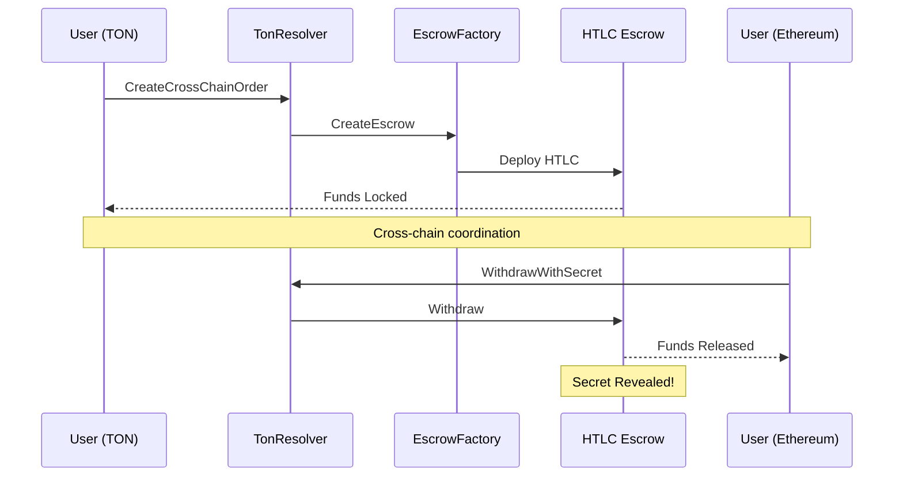

# TON Cross-Chain Resolver System

A comprehensive **Hash Time Locked Contract (HTLC)** system for TON blockchain that enables secure cross-chain atomic swaps with Ethereum and other blockchains.

## 🏗️ **System Architecture**

### **Core Components**

1. **🏭 EscrowFactory** - Creates and manages HTLC escrow contracts
2. **🔐 Escrow** - Individual HTLC contracts that lock funds with hashlock+timelock
3. **🔗 TonResolver** - High-level resolver that orchestrates cross-chain orders

```
┌─────────────────┐    ┌─────────────────┐    ┌─────────────────┐
│   TonResolver   │───▶│ EscrowFactory   │───▶│     Escrow      │
│                 │    │                 │    │                 │
│ • Order Mgmt    │    │ • Create HTLCs  │    │ • Lock Funds    │
│ • Security Fees │    │ • Track HTLCs   │    │ • Secret-based  │
│ • Cross-chain   │    │ • Validation    │    │   Withdrawal    │
│   Coordination  │    │ • Configuration │    │ • Timelock      │
└─────────────────┘    └─────────────────┘    └─────────────────┘
```

## 🔄 **How It Works**

### **1. Cross-Chain Order Flow**



### **2. Key Features**

✅ **Trustless Atomic Swaps** - No intermediaries needed  
✅ **Secret-based Unlocking** - Anyone with the secret can withdraw  
✅ **Timelock Protection** - Automatic refunds after expiration  
✅ **Security Deposits** - Incentivize honest behavior  
✅ **Cross-chain Coordination** - Works with any blockchain  
✅ **Emergency Controls** - Admin safety mechanisms  

## 📋 **Smart Contract APIs**

### **🔗 TonResolver**

#### **Create Cross-Chain Order**
```typescript
await tonResolver.sendCreateCrossChainOrder(sender, {
    value: tonAmount + safetyDeposit + gas,
    orderHash: "0x1234...",           // Unique order ID
    maker: "0xEthAddr...",            // Ethereum maker address
    ethereumToken: "0xUSDC...",       // Ethereum token
    tonToken: tonTokenAddress,        // TON token
    ethereumAmount: 1000000n,         // Ethereum amount
    tonAmount: toNano('10'),          // TON amount
    hashlock: hashlockValue,          // Hash of secret
    timelock: 3600,                   // 1 hour expiration
    safetyDepositAmount: toNano('0.5'),
    metadata: null
});
```

#### **Withdraw with Secret**
```typescript
await tonResolver.sendWithdrawWithSecret(sender, {
    value: toNano('0.05'),           // Gas
    orderHash: "0x1234...",          // Order to withdraw from
    secret: secretValue              // The secret that unlocks
});
```

#### **Deposit Security Fee**
```typescript
await tonResolver.sendDepositSecurityFee(sender, {
    value: additionalAmount + gas,
    orderHash: "0x1234...",
    amount: additionalAmount
});
```

#### **Cancel Expired Order**
```typescript
await tonResolver.sendCancelOrder(sender, {
    value: toNano('0.05'),
    orderHash: "0x1234...",
    reason: "Order expired"
});
```

### **🏭 EscrowFactory**

#### **Create HTLC Escrow**
```typescript
await escrowFactory.sendCreateEscrow(sender, {
    value: amount + safetyDeposit + deploymentCost,
    hashlock: hashlockValue,
    receiver: receiverAddress,
    timelock: 3600,                  // Relative seconds
    orderHash: "0x1234...",
    metadata: null
});
```

### **🔐 Escrow (HTLC)**

#### **Withdraw with Secret**
```typescript
await escrow.sendWithdrawEscrow(sender, {
    value: toNano('0.05'),
    secret: secretValue
});
```

#### **Refund after Expiration**
```typescript
await escrow.sendRefundEscrow(sender, {
    value: toNano('0.05')
});
```

## 🚀 **Deployment Guide**

### **1. Compile Contracts**
```bash
cd ton-contracts
npm install
npx blueprint build
```

### **2. Deploy System**
```bash
# Deploy EscrowFactory first
npx blueprint run deployEscrowFactory

# Deploy TonResolver with factory address
npx blueprint run deployTonResolver

# Run full system demo
npx blueprint run deployTonResolver
```

### **3. Test System**
```bash
npm test TonResolverSystem.spec.ts
```

## 💡 **Usage Examples**

### **Example 1: ETH ↔ TON Atomic Swap**

```typescript
// 1. Generate secret and hashlock
const secret = BigInt('12345678901234567890');
const hashlock = hashSecret(secret);

// 2. Create order on TON side
await tonResolver.sendCreateCrossChainOrder(tonUser, {
    value: toNano('100') + toNano('1') + toNano('0.2'),
    orderHash: generateOrderHash(),
    maker: '0xEthereumUserAddress...',
    ethereumToken: '0xUSDCAddress...',
    tonToken: tonTokenAddress,
    ethereumAmount: BigInt('100000000'), // 100 USDC
    tonAmount: toNano('100'),            // 100 TON
    hashlock: hashlock,
    timelock: 7200,                      // 2 hours
    safetyDepositAmount: toNano('1'),
    metadata: null
});

// 3. Create matching escrow on Ethereum (using same hashlock)
// ... Ethereum contract deployment ...

// 4. Either party can withdraw with the secret
await tonResolver.sendWithdrawWithSecret(anyUser, {
    value: toNano('0.05'),
    orderHash: orderHash,
    secret: secret  // This reveals the secret!
});

// 5. Use revealed secret to withdraw from Ethereum escrow
// ... Ethereum withdrawal ...
```

### **Example 2: USDC ↔ Jetton Swap**

```typescript
// Cross-chain USDC to TON Jetton swap
const order = {
    ethereumToken: '0xA0b86991c431E566F0c9e9E0d6F9b1c9e3f56732', // USDC
    tonToken: jettonMasterAddress,
    ethereumAmount: BigInt('1000000'), // 1 USDC (6 decimals)
    tonAmount: toNano('50'),           // 50 Jettons
    timelock: 3600,                    // 1 hour
    safetyDeposit: toNano('0.5')
};
```

## 🔒 **Security Features**

### **1. Timelock Protection**
- Orders automatically expire after specified time
- Refunds available to original sender after expiration
- No funds can be permanently locked

### **2. Secret-based Atomicity**
- Same secret unlocks both sides of swap
- Revealing secret on one side enables completion on other side
- True atomic swap guarantee

### **3. Safety Deposits**
- Incentivize honest behavior
- Compensate gas costs
- Configurable amounts per order

### **4. Emergency Controls**
- Owner can pause system in emergencies
- Emergency refund mechanisms
- Configurable timelock parameters

## 📊 **System Parameters**

| Parameter | Default | Description |
|-----------|---------|-------------|
| Min Safety Deposit | 0.1 TON | Minimum required safety deposit |
| Max Order Timelock | 24 hours | Maximum order expiration time |
| Min Order Timelock | 1 hour | Minimum order expiration time |
| Min Deploy Value | 0.05 TON | Minimum value for escrow deployment |
| Emergency Delay | 24 hours | Delay for emergency actions |

## 🧪 **Testing**

Run comprehensive test suite:

```bash
# Full system tests
npm test TonResolverSystem.spec.ts

# Individual contract tests
npm test EscrowFactory.spec.ts
npm test Escrow.spec.ts

# Integration tests
npm test integration/
```

**Test Coverage:**
- ✅ Order creation and management
- ✅ Security deposit handling  
- ✅ Secret-based withdrawals
- ✅ Timelock expiration
- ✅ Emergency controls
- ✅ Cross-chain coordination
- ✅ Error handling and edge cases

## 🔧 **Configuration**

### **Factory Settings**
```typescript
// Update factory configuration
await escrowFactory.sendUpdateConfig(owner, {
    newMinAmount: toNano('0.01'),
    newMaxTimelock: 86400,      // 24 hours
    newMinTimelock: 3600,       // 1 hour
    paused: false
});
```

### **Resolver Settings**
```typescript
// Pause/unpause resolver
await tonResolver.send(owner, { value: toNano('0.05') }, 'pause');
await tonResolver.send(owner, { value: toNano('0.05') }, 'unpause');
```

## 🌉 **Cross-Chain Integration**

### **Ethereum Side**
- Use existing Ethereum escrow contracts from `contracts/lib/cross-chain-swap/`
- Match hashlock and timelock parameters
- Coordinate order creation timing

### **Other Blockchains**
- Implement similar HTLC contracts
- Use same secret/hashlock mechanism
- Ensure timelock compatibility

## 📈 **Monitoring & Analytics**

### **Query Order Status**
```typescript
const order = await tonResolver.getOrder(orderHash);
const status = await tonResolver.getOrderStatus(orderHash);
const escrowAddr = await tonResolver.getOrderEscrow(orderHash);
```

### **Factory Statistics**
```typescript
const factoryInfo = await escrowFactory.getFactoryInfo();
console.log('Total Escrows:', factoryInfo.totalEscrows);
```

### **Resolver Statistics**
```typescript
const resolverInfo = await tonResolver.getResolverInfo();
console.log('Total Orders:', resolverInfo.totalOrders);
```

## 🛠️ **Development**

### **Project Structure**
```
ton-contracts/
├── contracts/
│   ├── escrow_factory.tact      # HTLC factory
│   ├── escrow.tact              # Individual HTLC
│   └── ton_resolver.tact        # High-level resolver
├── scripts/
│   ├── deployEscrowFactory.ts   # Factory deployment
│   ├── deployTonResolver.ts     # Resolver deployment  
│   └── deployTonResolver.ts     # Full system demo
├── tests/
│   ├── EscrowFactory.spec.ts    # Factory tests
│   ├── Escrow.spec.ts          # Escrow tests
│   └── TonResolverSystem.spec.ts # System tests
└── wrappers/                    # TypeScript wrappers
```

### **Adding New Features**
1. Modify Tact contracts
2. Update TypeScript wrappers
3. Add comprehensive tests
4. Update documentation

## 🎯 **Use Cases**

- **DEX Arbitrage** - Cross-chain trading opportunities
- **Cross-chain DeFi** - Yield farming across chains  
- **Payment Rails** - Instant cross-chain payments
- **NFT Trading** - Cross-chain NFT marketplaces
- **Stablecoin Swaps** - USDC/USDT cross-chain transfers

## 📞 **Support**

For questions, issues, or contributions:
1. Check existing tests for usage examples
2. Review contract documentation
3. Test on TON testnet first
4. Follow security best practices

## 🔐 **Security Considerations**

⚠️ **Important Security Notes:**

1. **Secret Management** - Keep secrets secure until ready to execute
2. **Timelock Coordination** - Ensure sufficient time for cross-chain execution
3. **Gas Estimation** - Account for gas costs on both chains
4. **Testing** - Thoroughly test with small amounts first
5. **Monitoring** - Monitor order status and timelock expiration

---

## 🎉 **Ready for Cross-Chain!**

Your TON Cross-Chain Resolver System is now ready to enable secure, trustless atomic swaps between TON and any other blockchain! 

🌉 **Start building the future of cross-chain DeFi!** 🚀
